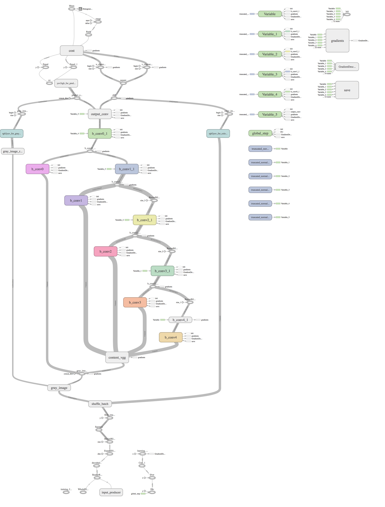

# Residual Encoder Network for Colorization

## Overview

This is a tensorflow version implementation for Residual Encoder Network based on [Automatic Colorization](http://tinyclouds.org/colorize/).

Used pre-trained VGG16 model from [https://github.com/machrisaa/tensorflow-vgg](https://github.com/machrisaa/tensorflow-vgg)

## Structure

* `config.py`: config variables like learning rate, batch size and so on
* `image_helper.py`: all function related to image manipulation
* `read_input.py`: input related functions
* `residual_encoder.py`: the residual encoder model
* `batchnorm.py`: batch normalization based on [here](http://stackoverflow.com/questions/33949786/how-could-i-use-batch-normalization-in-tensorflow)
* `common.py`: the common part for train and test, mainly is the work flow for this model
* `train.py`: train the residual encoder model using tensorflow build-in GradientDescentOptimizer
* `test.py`: test your own image and save the output image

## Tensorflow graph

## How to use

* First please download pre-trained VGG16 model [vgg16.npy](https://mega.nz/#!YU1FWJrA!O1ywiCS2IiOlUCtCpI6HTJOMrneN-Qdv3ywQP5poecM) to vgg folder

* Use pre-trained residual encoder model
    * Model can be downloaded [here](https://github.com/Armour/Automatic-Image-Colorization/releases/tag/1.0)
    * Uncompress and put all files under `model_path` which you can change in config.py

* Train yourself
    1. Change the `learning rate`, `batch size` and `training_iters` according to your goal
    2. Change `train_dir` to your directory that contains all your training jpg images
    3. Run `python train.py`

* Test
    1. Change `test_dir` to your directory that contains all your testing jpg images
    2. Run `python test.py`

## Reference

* [Automatic Colorization](http://tinyclouds.org/colorize/)
* [pavelgonchar/colornet](https://github.com/pavelgonchar/colornet)
* [pretrained VGG16 npy file](https://github.com/machrisaa/tensorflow-vgg)

## License

GNU GPL 3.0 for personal or research use. COMMERCIAL USE PROHIBITED.
