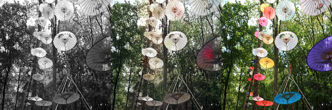
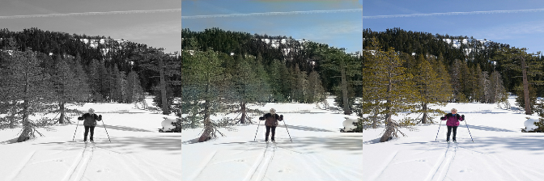
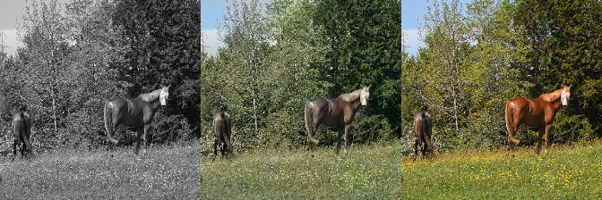
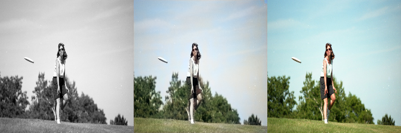
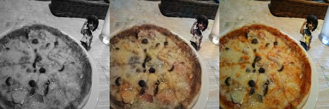
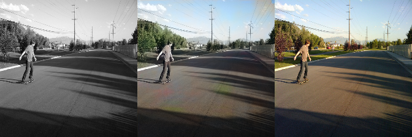
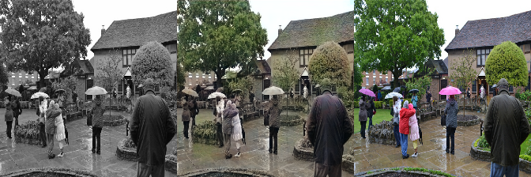

# Automatic Image Colorization

## Overview

This is a Tensorflow implementation of the Residual Encoder Network based on [Automatic Colorization](http://tinyclouds.org/colorize/) and the pre-trained VGG16 model from [https://github.com/machrisaa/tensorflow-vgg](https://github.com/machrisaa/tensorflow-vgg)

## Structure

* `config.py`: config variables like batch size, training_iters and so on
* `image_helper.py`: all functions related to image manipulation
* `read_input.py`: all functions related to input
* `residual_encoder.py`: the residual encoder model
* `common.py`: the common part for training and testing, which is mainly the workflow for this model
* `train.py`: train the residual encoder model using Tensorflow built-in AdamOptimizer
* `test.py`: test your own images and save the output images

## Tensorflow graph

## How to use

* First please download pre-trained VGG16 model [vgg16.npy](https://mega.nz/#!YU1FWJrA!O1ywiCS2IiOlUCtCpI6HTJOMrneN-Qdv3ywQP5poecM) to vgg folder

* Option 1: Use pre-trained residual encoder model
  * Model can be downloaded [here](https://github.com/Armour/Automatic-Image-Colorization/releases/tag/2.0)
  * Unzip all files to `summary_path` (you can change this path in `config.py`)

* Option 2: Train your own model!
  1. Change the `batch_size` and `training_iters` if you want.
  2. Change `training_dir` to your directory that contains all your training jpg images
  3. Run `python train.py`

* Test
  1. Change `testing_dir` to your directory that contains all your testing jpg images
  2. Run `python test.py`

## Examples

* 
* 
* 
* 
* 
* 
* 
* 
* 
* 
* 
* 

* More example output images can be found in [sample_output_images](https://github.com/Armour/Automatic-Image-Colorization/blob/master/sample_output_images) folder.

## References

* [Automatic Colorization](http://tinyclouds.org/colorize/)
* [pavelgonchar/colornet](https://github.com/pavelgonchar/colornet)
* [raghavgupta0296/ColourNet](https://github.com/raghavgupta0296/ColourNet)
* [pretrained VGG16 npy file](https://github.com/machrisaa/tensorflow-vgg)

## Contributing

See [CONTRIBUTING.md](https://github.com/Armour/Automatic-Image-Colorization/blob/master/.github/CONTRIBUTING.md)

## License

[GNU GPL 3.0](https://github.com/Armour/Automatic-Image-Colorization/blob/master/LICENSE) for personal or research use. COMMERCIAL USE PROHIBITED.
